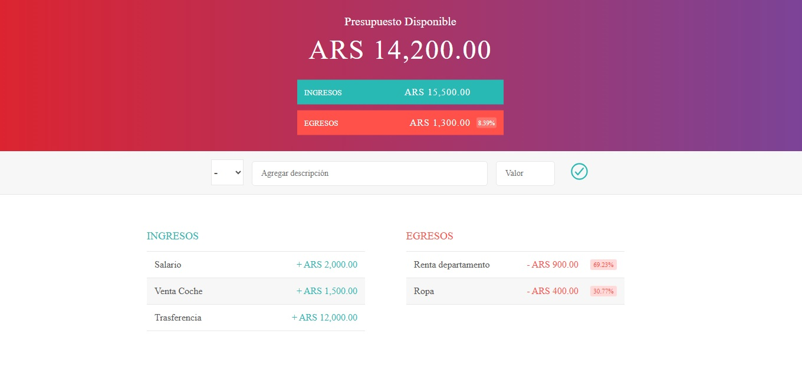

# Aplicación de Presupuesto

Aplicación sencilla hecha con HTML, CSS y JavaScript para gestionar ingresos y egresos, calculando el presupuesto disponible en tiempo real.

## Funcionalidades
- Agregar ingresos.
- Agregar egresos.
- Cálculo automático del presupuesto total.
- Visualización de porcentajes de gasto.
- Eliminar ingresos y egresos.

## Estructura del proyecto
```
proyecto_1
│
├── index.html              # Página principal
│
├── css/
│   └── estilos.css         # Estilos de la app
│
├── js/
│   ├── app.js              # Lógica principal
│   ├── Dato.js             # Clase base
│   ├── Ingreso.js          # Clase para ingresos
│   └── Egreso.js           # Clase para egresos
│
├── img/
│   └── fondo.png           # Imagen de fondo
│
└── README.md               # Documentación del proyecto
```

## Uso
1. Clonar el repositorio:
   ```bash
   git clone https://github.com/TU_USUARIO/presupuesto-app.git
   ```
2. Abrir el archivo `index.html` en tu navegador.

## Tecnologías utilizadas
- HTML5
- CSS3
- JavaScript Vanilla (ES6+)

## Captura de pantalla
Asi se va a ver tu app:



